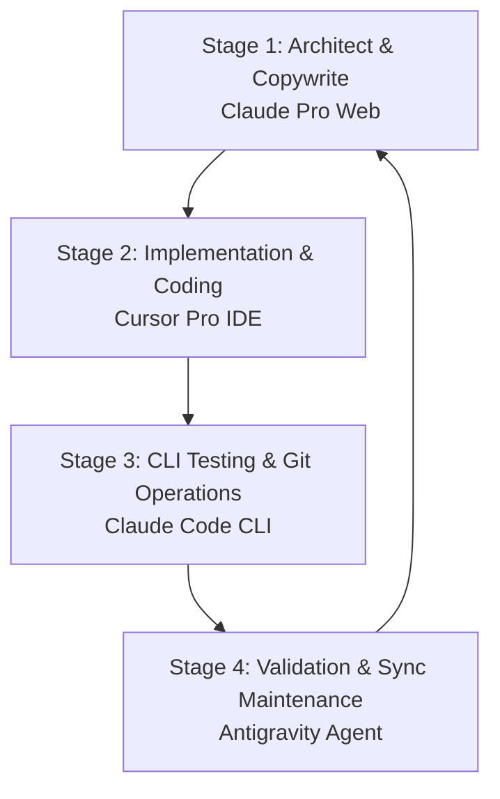

# 🤖 Multi-Agent Development Workflow Guide

This guide outlines a seamless, modern workflow combining **Cursor Pro**, **Claude Pro**, **Antigravity CLI/IDE (Gemini Pro)**, and **Claude Code** to optimize and refine your software projects, assigning tasks based on the specific strengths of each AI system.

---

## 📊 Overview of Agent Strengths

| Agent Tool | Core Strength | Ideal Tasks | How to Trigger |
| :--- | :--- | :--- | :--- |
| **Cursor Pro** *(IDE)* | Real-time inline completions, Composer-driven code edits, and visual local workspace navigation. | - Rapid UI coding & layout adjustments - Refactoring single-file functions - Interactive visual debugging | Use Composer `Cmd+I` to edit files in your active editor. |
| **Claude Pro** *(Web Chat)* | Conceptual reasoning, high-impact copywriting, and complex architectural design. | - Tailoring resumes & cover letters - Writing deep README files - Designing database schemas | Upload files/logs directly to Claude Web interface for strategic review. |
| **Antigravity** *(Gemini Agent)* | Autonomous background planning, filesystem execution, tool integration, and structural validation. | - Running sync scripts (GitHub Sync) - Project data integrity checks - Multi-file content upgrades - Background task management | Ask Antigravity in the IDE Chat to run plans, checks, or refactoring loops. |
| **Claude Code** *(CLI Agent)* | Fast terminal operations, git management, and CLI test/debug execution loops. | - Setting up Docker & servers - Executing test suites (`pytest`, `npm test`) | Run `claudecode` directly in your terminal for immediate CLI assistance. |

---

## 🔄 The 4-Stage Multi-Agent Development Loop

To improve and refine any of your projects (whether this portfolio or an ML system), follow this coordinated workflow loop:

### 1. 📝 Stage 1: Design & Plan (Claude Pro)
*   **The Action:** Upload your project ideas, raw API specifications, or database diagrams to **Claude Pro (Web)**.
*   **Tasks assigned:** 
    *   Drafting structural README files and code layout specifications.
    *   Formulating prompt strategies or writing high-impact copy.
*   **Example Prompt:** *"Here is my API requirement. Outline a modular FastAPI file structure and write the draft database schema."*

### 2. 💻 Stage 2: Code & Build (Cursor Pro)
*   **The Action:** Open the project in **Cursor**. Use the files and architecture plans designed in Stage 1.
*   **Tasks assigned:**
    *   Writing the code using tab-completions.
    *   Using Cursor Composer (`Cmd+I`) to create and modify frontend/backend components.
*   **Example Prompt:** *"Create the UserProfile component based on this schema and style it using vanilla CSS matching our theme."*

### 3. 🧪 Stage 3: Test & Commit (Claude Code)
*   **The Action:** Launch **Claude Code** in your terminal directory.
*   **Tasks assigned:**
    *   Executing unit tests and parsing tracebacks to fix bugs.
    *   Setting up Docker networks or deploying local database instances.
    *   Running git diff reviews, committing, and pushing code.
*   **Example Command:** *"Run npm test, fix any failing assertions in the authentication helper, and commit the changes with a descriptive message."*

### 4. 🧹 Stage 4: Maintain & Validate (Antigravity)
*   **The Action:** Invoke **Antigravity** inside the agent workspace.
*   **Tasks assigned:**
    *   Running repository sync tasks (e.g. `npm run sync:github-projects`).
    *   Running link validators and data-structure checks (e.g. `validate-project-links.mjs`).
    *   Running long-running background tasks or managing local database migrations.
*   **Example Prompt:** *"Antigravity, run the project synchronization script, clean up Prettier formatting syntax warnings, and verify the build compiles."*
