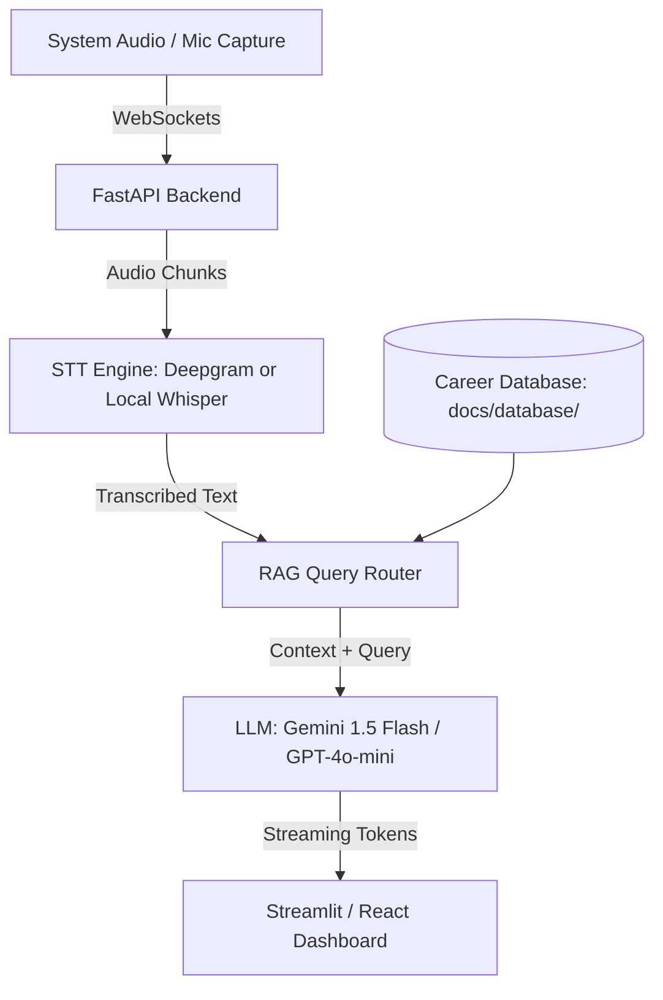

# 🎙️ Project Proposal: Live Voice Interview Copilot

This proposal outlines the architecture, setup plan, and directory structure for a **Live Voice Interview Copilot** designed to capture real-time audio, transcribe the interviewer's questions, search your career database, and generate tailored answer guides instantly during interviews.

---

## 🏛️ Repository Decisions: Where to Build?

**We should build this in a NEW, SEPARATE repository** (e.g., `interview-voice-copilot`) rather than inside your portfolio repository.

### Why Separate?
1.  **Architecture Mismatch:** Your portfolio is a static React client built for GitHub Pages. A live voice copilot requires a persistent backend service (FastAPI) to handle WebSockets, microphone capture, and system audio loopback.
2.  **Audio System Dependencies:** Local speech-to-text (STT) requires Python libraries (e.g., `PyAudio`, `faster-whisper`) or API integrations that do not run inside static browser bundles.
3.  **Clean Separation of Concerns:** Your portfolio remains a clean showcase site. The Copilot is a standalone tool that you run locally on your system. Once built, you can document it and add it as a new featured project in your portfolio!

---

## 🛠️ System Architecture

The tool will combine real-time audio streaming, low-latency Speech-to-Text (STT), and in-context LLM retrieval:



### 1. Audio Ingestion (Frontend/Client)
*   **Mic Capture:** HTML5 Web Audio API (`navigator.mediaDevices.getUserMedia`) in a simple React or Streamlit component.
*   **System Audio Capture (Nice-to-Have):** Use a virtual audio cable loopback (like BlackHole on macOS) to route the interviewer's voice from Zoom, Google Meet, or MS Teams into the app.
*   **Transmission:** Streams audio in chunks via WebSockets to the local backend.

### 2. Speech-to-Text (STT) Engine (Backend)
*   **Option A (Low Latency / Cloud):** **Deepgram Streaming API** or **OpenAI Realtime**. Deepgram provides sub-100ms real-time transcription and handles interruptions gracefully.
*   **Option B (Local / Free):** **`faster-whisper`** running locally on your MacBook (takes advantage of Apple Silicon MPS/CPU).

### 3. Contextual Retrieval (RAG)
*   Because your career database (`experience.md`, `skills_matrix.md`, `story_bank.md`, and individual projects) is under **200KB**, we do **not** need a complex vector database.
*   We can load the **entire career database directly into the LLM system prompt / context window** at startup. This guarantees 100% retrieval accuracy and eliminates vector database query lag.

### 4. Streaming Generative Answers (LLM)
*   **LLM Choice:** **Gemini 1.5 Flash** (via Google AI Studio SDK) or **GPT-4o-mini**. Both are fast, cost-effective, and support token streaming.
*   **Wording & Prompts:** The system prompt instructs the LLM to format answers in short, bulleted notes (e.g., *"Reference your Shopee K-Means clustering project; detail the 15% ROI increase"*), preventing you from reading long walls of text.

---

## 📂 Proposed Repository Structure

Here is how the new repository `interview-voice-copilot` should be organized:

```text
interview-voice-copilot/
├── backend/
│   ├── app/
│   │   ├── __init__.py
│   │   ├── main.py                     <-- FastAPI app & WebSocket handlers
│   │   ├── audio.py                    <-- Audio chunk buffer & STT client
│   │   ├── copilot.py                  <-- LLM prompt and response stream
│   │   └── database.py                 <-- Loader for your career markdown files
│   ├── requirements.txt
│   └── Dockerfile
├── frontend/                           <-- Simple dashboard to render outputs
│   ├── src/
│   │   ├── App.tsx                     <-- Split screen UI (Transcripts vs Answers)
│   │   └── hooks/useAudioStream.ts     <-- Mic capture & WebSocket stream
│   ├── package.json
│   └── vite.config.ts
├── db/                                 <-- Symlinked or copied database from portfolio
│   ├── experience.md
│   ├── story_bank.md
│   └── projects/
└── README.md
```

---

## 🚀 Phase-by-Phase Build Plan

### Phase 1: Local Audio Capture & STT (Days 1–3)
*   Set up the FastAPI WebSocket endpoint.
*   Write a simple HTML/JS page that captures audio from `getUserMedia` and streams it as PCM chunks over the WebSocket.
*   Hook the backend to **Deepgram** (or local `faster-whisper`) and print the real-time transcript to the terminal console.

### Phase 2: Context Injection & LLM Setup (Days 4–5)
*   Write a parser that reads all markdown files from your career database and joins them into a single context string.
*   Create the LLM prompt. Set up the streaming response wrapper using the Gemini/OpenAI SDK.
*   Test sending typed questions to see if the LLM successfully references your Shopee metrics or PwC scripts.

### Phase 3: The Split-Screen UI Dashboard (Days 6–8)
*   Build a responsive, modern React (Vite) interface:
    *   **Left Pane:** Shows the rolling live transcription (what the interviewer is saying).
    *   **Right Pane:** Shows the streaming response (Suggested projects, STAR stories, key metrics, and recommended talking points).
    *   **Top Bar:** Textbox to copy-paste the target Job Description (so the LLM filters your background based on the job requirements).

### Phase 4: System Loopback & Polish (Days 9–10)
*   Configure system audio loopback (e.g. using Loopback or BlackHole on Mac) so the browser can capture speaker audio (from Zoom/Meet) as well as your microphone.
*   Package the application in a Docker container or write a simple script to launch the backend and frontend together locally.
